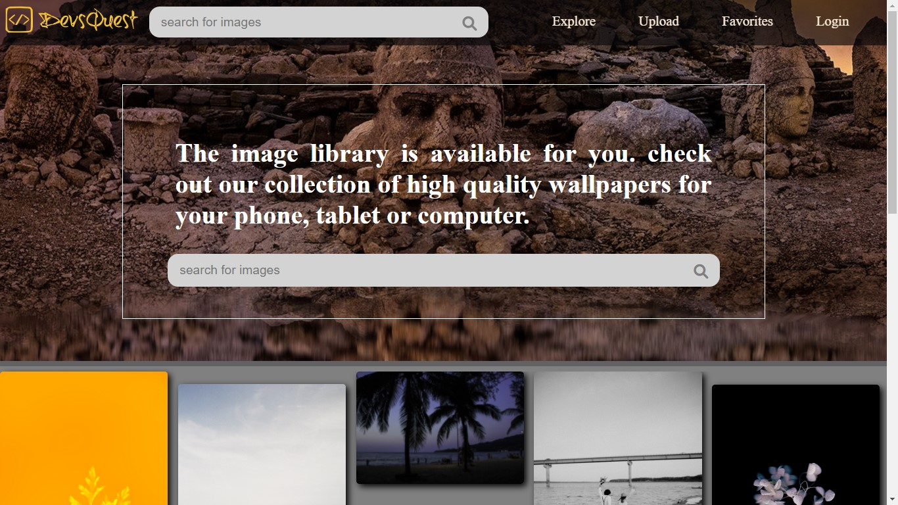

# Wallpapers App

Created web this application Reactjs  
The images are sourced by the pexels api which is free and very resourcefull  
It incoporates realtime image search with input in search parameters  
For demonstration purposer the version uploaded here uses a memes api due to it's free to use policy 
I will add a backend serice using MongoDB 

